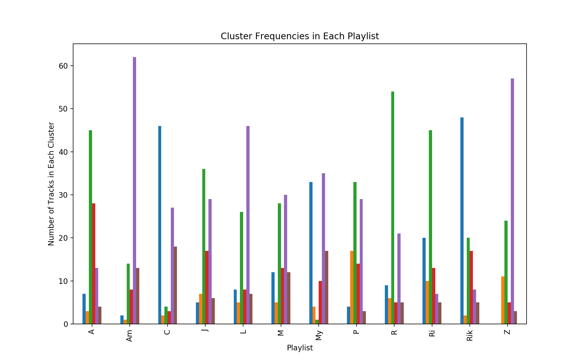
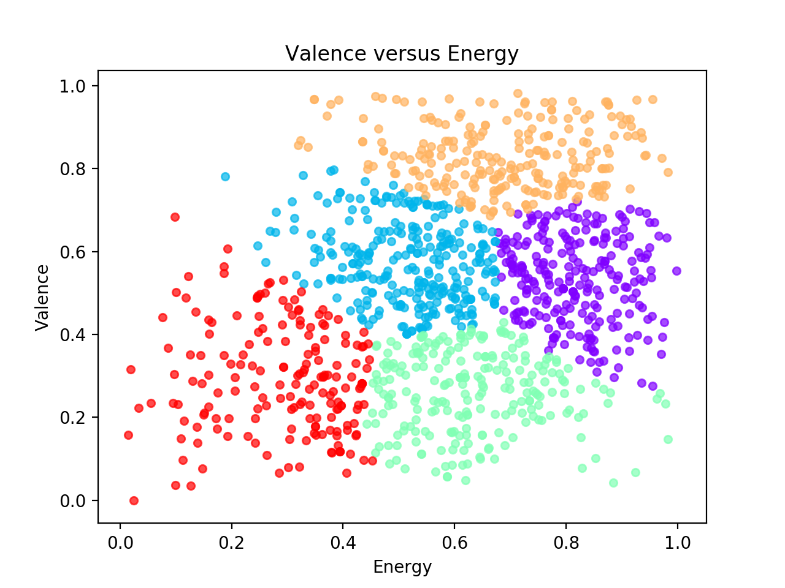
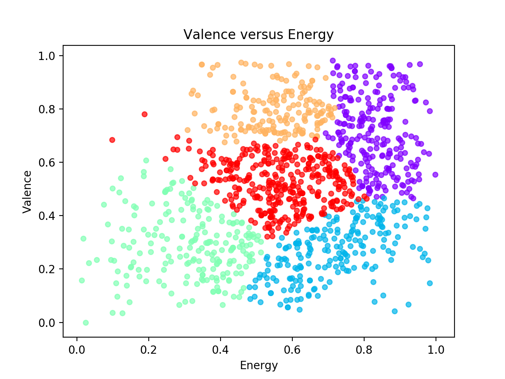
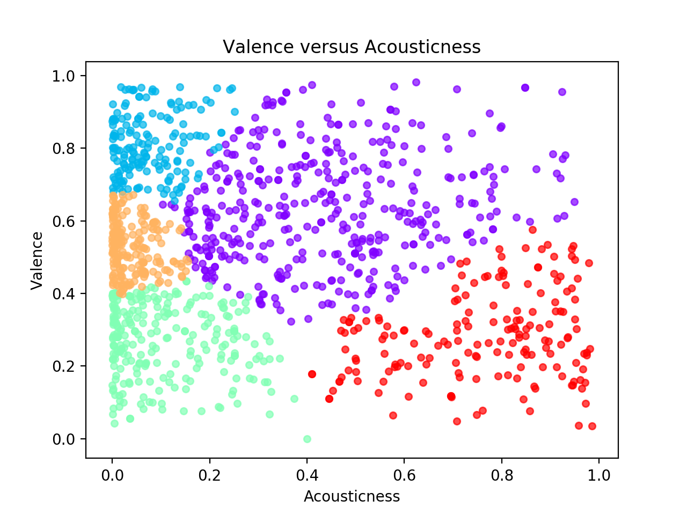
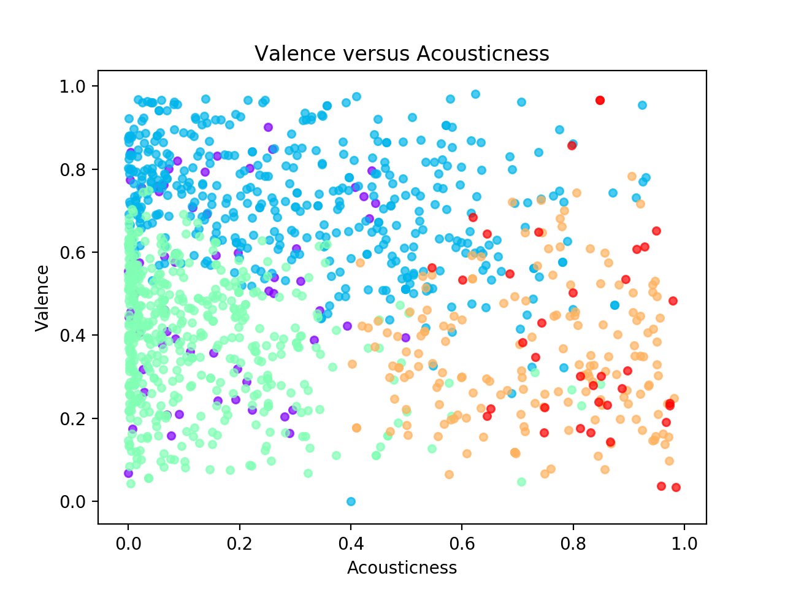

# Playlist Analyzer for Spotify
#### *Created by [Matt Levin](https://www.matt-levin.com/)*
*Is it possible for a computer to automatically identify your taste in music and generate playlists of new music that you would enjoy based on your Top 100 most played songs? Can multiple users’ Top 100 playlists be used to instantly create a collaborative playlist for a group study session, or to visualize the differences in their music tastes?*

Inspired by Spotify's [2017 Wrapped](https://2017wrapped.com) feature, I set out to determine what insights could be gathered from a user’s Top 100 playlist and how to apply this data in a meaningful way. After collecting Top 100 playlists from 12 different Spotify users, I began working on various functions using the [Spotify Web API](https://beta.developer.spotify.com/documentation/web-api/) to see what could be done with the data.

Though it started out as simply finding the most popular artists in a playlist, this project quickly grew into a machine learning focused program with various functions including: creating a playlist of the most danceable or study-able tracks from a group of input playlists, generating a playlist to mimic the audio features of a user’s Top 100 tracks, and clustering the tracks of multiple users’ Top 100 playlists using different combinations of audio features. Although these are the major functions so far, there are a plethora of fun and useful potential features for end-users waiting to be made using this sort of data and analysis.

This project is built around the Spotify Python Wrapper, [Spotipy](https://github.com/plamere/spotipy), using various tools such as [scikit-learn](http://scikit-learn.org/stable/) and [pandas](https://pandas.pydata.org/). *Note: Although much of this project is designed with Top 100 playlists in mind, it is still generally applicable to any playlists used as input.*

## Features
This project consists of several features listed below, with more details about each in the following subsections. Instructions on how to use each feature can be found in the Usage section, and examples of the results are in the Sample Output section.
* **Classify which playlist a song is most likely to be in based on its audio features.**
* **Predict which songs a user would enjoy, creating a Spotify playlist musically similar to their Top 100 playlist.**
* **Generate a playlist of the most danceable songs from a group of source playlists.**
* **Make a playlist of the tracks best suited for quiet studying from multiple input playlists.**
* **Find and display the artists with the most tracks in a playlist.**
* **Cluster the tracks from multiple playlists based on any subset of audio features, and visualize the resulting clusters.**

#### Playlist Classification and Prediction
For each input playlist, the track metadata and audio features (obtained from the Spotify API) are written into a CSV file. The data from all the input playlists is then used to train a model to classify which source playlist a given track is from based on the audio features of the track. Once trained, the model can then be used to generate a playlist of tracks that it predicts would most likely be from a given playlist. In other words, it picks tracks that the user would enjoy since they are musically similar to the songs in their Top 100 list, which were used in training the model. For each track, the trained model gives a probability that it is from a given playlist. So by choosing the tracks with the highest probability of being from the selected source playlist, it generates a playlist that mirrors the audio profile of the original playlist.

Either a Multilayer Perceptron (MLP) classifier *(sklearn.neural_network.MLPClassifier)* or a Gaussian Naive Bayes classifier *(sklearn.naive_bayes.GaussianNB)* can be trained as the model for classification. However, I have found that the MLP classifier performs better on this dataset, so it is the model used in playlist generation. Any combination of audio features can be used in the training and prediction, however by default all available features are used.

#### Dance Party and Study Buddies Playlist Generators
Another neat feature is the generation of custom playlists for either dancing or studying, by selecting a few tracks from each input playlist. For example, if 4 friends are studying together and want to play music they will all enjoy and be able to study to, this tool would automatically choose the best songs for studying from each of their Top 100 playlists. This way, all the users in the group would enjoy the playlist since it is sourced from their own playlists, and it is optimized for studying by utilizing Spotify's audio features for each track. This tool could be a great feature from a social perspective, since it tailors a playlist not just to one user, but to a group of users. 

The dance party function uses a combination of the *danceability* and *energy* audio features to choose the tracks, while study buddies uses *instrumentalness, acousticness, energy,* and *speechiness*. The choice to use these combinations of audio features intuitively make sense, at least in my opinion, for creating a playlist conducive to dancing or studying. By simply adjusting which audio features are used to make the selections, this framework is easily adaptable to other situations well beyond dancing and studying, such as working out or road trips. Additionally, the source playlists don't need to be Top 100 playlists, so users could input their own study playlists to generate a new playlist of the songs deemed best for studying from each of the input playlists.

#### Top Artists in a Playlist
This feature extracts the artists who show up most often in a given playlist, and displays their names and how many of their tracks are in the playlist. It takes into account the fact that songs can have more than one artist, and also shows the total number of artists who are present in the playlist. Although less technically advanced than the previous two features, this feature was requested by some of the users who sent me their Top 100 lists, and I was also curious to find out about my own playlist.

#### Cluster Visualization
Clustering can be performed on the data using any combination of audio features. After the clusters are found, several plots are created and shown to the user. To reaffirm the belief that different users' playlists have very different audio trends, the distribution of clusters for each playlist is shown as a bar chart. After that initial plot is displayed, a scatter plot is shown for each pair of audio features. See the Sample Output section below for examples of these plots. The features used in plotting can also be customized, and an x or y-axis feature can be specified so that only the plots with that feature are shown (i.e. if you only wanted to see plots with *energy* on the y-axis). Both Gaussian Mixture Model and Spectral clustering are supported.

## Usage
To use the script use `python playlist_analyzer.py` with any of the following sets of parameters (Optional parameters are in square brackets):

* `-h` or `--help`
  * Shows a help message.

* `-g [-p Playlist_CSV_Filename] [-n Number_Of_Songs_To_Include]`
  *	Generates a playlist similar to the given playlist using a neural network.
  *	An MLP classifier is trained to predict which playlist each track comes from based on its audio features. Then the trained model selects the tracks, from all available playlists, that it deems most likely to be from the given playlist (AKA tracks the user would like, since they are musically similar to their Top 100 list) and creates a Spotify playlist of these tracks.
  *	*Note: The -p argument expects the name of the CSV file containing the audio analysis of the tracks in the playlist, not the playlist ID/URI.*

* `-d [-n Number_Songs_From_Each] [-p Playlist_CSV_Names]`
	* Generates a 'Dance Party' playlist from given Playlist CSV file names, picking n 'danceable' songs from each source playlist.
	* *Note: The -p argument expects playlist CSV file names (not playlist ID/URIs) and should be a comma separated list.*

* `-s [-n Number_Songs_From_Each] [-p Playlist_CSV_Names]`
	* Generates a 'Study Buddies' playlist from given Playlist CSV file names, picking n 'study-able' songs from each source playlist.
	* *Note: The -p argument expects playlist CSV file names (not playlist ID/URIs) and should be a comma separated list.*

* `-a [-p Playlist_ID] [-n Number_Of_Artists_To_Display]`
	* Shows top occurring n Artists in a Playlist (defaults to showing all artists present in the playlist in order if n is not specified).

* `-w [-p Playlist_ID]`
	* Writes a CSV file of audio features and metadata for the given playlist.
	* Defaults to creating a CSV file for each of the user's playlist with 'Top 100' in the name if no argument is provided.

* `-c [-a Algorithm] [-n Number_Of_Clusters]`
	* Performs clustering with given algorithm {'GMM' or 'spectral'} and the specified number of clusters.

* *Running with no command line arguments will execute unit testing of the various functions.*

*Note: The following environment variables must be set in order to run the script locally:*
`SPOTIFY_USERNAME, SPOTIFY_CLIENT_ID, SPOTIFY_CLIENT_SECRET, SPOTIFY_REDIRECT_URI`

## Sample Output
The following subsections contain example results from the different features contained in this project. Some are links to open a playlist in Spotify, while others are images of plots, or simply text.
*Note: Any linked Spotify playlists may contain explicit content, parental discretion is advised.*

#### Classification and Prediction
The following two examples show how well the classifier is able to distinguish between musical tastes. It is clear from the original playlists that these two users have very different music tastes. The generated playlists reflect this distinction, and contain a mix of tracks from their original Top 100 list as well as new tracks that they would very likely enjoy (as confirmed with feedback from several users). *Note: Removal of duplicates causes some generated playlists to have fewer than N (100 in these examples) tracks.* 
*Example 1:* [Original Playlist One](https://open.spotify.com/user/12583161/playlist/7r3W3DbQBEbtTg0b7q0MQw?si=BQuncXs1QqaB-G48ZMbW0Q) was used to create [Generated Playlist One](https://open.spotify.com/user/12583161/playlist/3UcemYA67P5oeg05m9iiDr?si=XJn-yXCbSwu0UsuCbuReaw). 
*Example 2:* [Original Playlist Two](https://open.spotify.com/user/12583161/playlist/6g263m0E8SI1HzIcMFeRVu?si=anuMZsUNQOCtPKM9pEMKfQ) was used to create [Generated Playlist Two](https://open.spotify.com/user/12583161/playlist/2UCjB6tudcrj4Kcvs9t2nl?si=FOTZLDWkShqTspes2c_v_g).

The classification accuracy was benchmarked with many permutations of parameters, with an example benchmarking output of the MLP classifier is available [here](sample_output/MLP_Benchmarking.txt). The MLP generally performed better than the Naive Bayes model, correctly labeling ~35% of the dataset. This may seem low, however randomly assigning labels would result in ~8% accuracy, since there are 12 possible playlists to choose from. When you also take into account that some of these 12 users have similar music tastes, a 'wrong' classification could still assign the track to someone who would enjoy it, just not the playlist where it was originally found.

#### Dance Party and Study Buddies Playlists
This example [Dance Party Playlist](https://open.spotify.com/user/12583161/playlist/5onELi6ix28gqUMHOqUJhu?si=alZ-xOHlTQuWesXdvcgKqA) consists of 5 tracks from 3 different users' playlists, and clearly captures the rap/trap essence that is present in each of their playlists.

This [Study Buddies Playlist](https://open.spotify.com/user/12583161/playlist/6EfEdWWpdk3bhF2mzE0iwr?si=jCmWlj8mSqKJ6FaYknbfvw) takes 6 tracks from 5 different users' playlists, creating a relatively cohesive playlist very well suited to quiet group studying.

Overall, these two features depend pretty heavily on how similar the playlists are, since taking the most danceable songs from someone who listens to hip-hop and someone who listens to disco would result in a very strange and non-cohesive playlist. Sequential analysis to minimize the change in audio features between successive tracks could help build cohesion in the generated playlists for these cases in the future.

#### Top Artists
The output for the top artists feature is more simple (just text) and can be seen below. The following is the output of finding the top 10 artists in the 'A Top 100' playlist:

>Finding the top artists in A Top 100...
>
>Top 10 artists in playlist: 
10 songs -  Kendrick Lamar                
10 songs -  Frank Ocean                   
9 songs  -  Kanye West                    
8 songs  -  Action Bronson                
5 songs  -  Joey Bada$$                   
5 songs  -  BadBadNotGood                 
5 songs  -  Anderson .Paak                
4 songs  -  Tyler, The Creator            
4 songs  -  The Weeknd                    
4 songs  -  Statik Selektah               
>
>81 different artists appeared in this playlist.

[Click here](sample_output/Top_Artists_Full.txt) to see the output of this feature where all the artists in a playlist are displayed, not just the top 10. 

#### Clustering
Clustering was performed using various subsets of the available audio features, and two different clustering algorithms: Gaussian Mixture Model (GMM) and Spectral. The following subsections contain the output for the distribution of clusters among different playlists, a comparison of GMM and Spectral clustering, and a comparison between clustering using all the features versus only using two.

##### Cluster Distribution Bar Chart
The following plot shows the number of tracks that are assigned to each cluster for each different playlist. The goal of this plot is to emphasize how the different playlists, thus the different users, have different musical tastes, and how that can be identified with clustering. Being familiar with the playlists and the users who provided them, it seems likely that the green line/cluster represents rap/trap music, while the purple line is acoustic/singer-songwriter tracks, and the blue line is for rock/funk. Of course, this is not necessarily the case, but it would make sense based on the content of the different playlists. The other clusters are harder to identify from this graph, however the key takeaway is that clustering is able to differentiate the different music tastes based on audio features. 

*This particular graph uses Gaussian Mixture Model clustering on all the available audio features, using 6 cluster centers.*

##### Gaussian Mixture Model versus Spectral Clustering
So far two different methods for clustering have been implemented: Gaussian Mixture Model and Spectral. Below is an example comparing the different clusters found when only the *energy* and *valence* audio features are used in clustering. Of course, the order/color of the clusters are arbitrary, however there are several notable differences between the two algorithms in the way the tracks are split up among the resulting clusters. In the future, I plan on adding k-means clustering, and possibly other algorithms as well.

GMM Clustering            |  Spectral Clustering
:------------------------:|:---------------------:
|

##### Clustering Using All Features versus Only a Subset
The following are both created using spectral clustering with 5 clusters. The left column is clustered using only the *valence* and *acousticness* audio features, while the right column used all the available features. Clearly the plots are very different, as the left column shows how we typically visualize clustering, while the right column was clustered using more features than could fit on this 2D plot. 

Using Only Valence and Acousticness  |  Using All Features
:-----------------------------------:|:--------------------:
|

## Summary
This project contains various functions to draw insights and create customized content based on different users' Top 100 playlists. Along the way, I've discovered some cool songs and artists from friends' Top 100 lists. More importantly, I have been able to share not only insights, but customized playlists with my friends for either dancing, studying, or just mimicking the audio profile of their Top 100 list. I have received positive feedback from several of the users who sent me their playlists, and will definitely continue working on this project and implementing new features in the future.

Feel free to contact me ([mlevin6@u.rochester.edu](mailto:mlevin6@u.rochester.edu)) with any comments or suggestions about this project!

&nbsp;

---

*I have no affiliation with Spotify, I just wanted to explore the API and try to find interesting insights from various users' Top 100 Playlists. All data provided by [Spotify](https://www.spotify.com)'s Web API.*