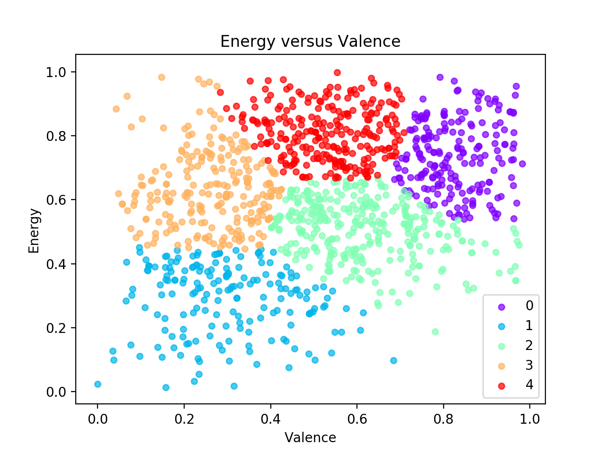

# Playlist Analyzer for Spotify
#### Created by [Matt Levin](https://www.matt-levin.com/)

*Need a playlist for a group study session that you'll all enjoy? Want a custom generated playlist based on the audio features of your Top 100 songs? Interested in learning more about your music taste?* 

This project gives solutions to these problems and more. Inspired by Spotify's 2017 Wrapped feature, I set out to see what insights could be extracted from different users' Top 100 playlists. I gathered Top 100 playlists from 12 Spotify users, and began working on various functions using the Spotify API to see what could be done with the data.

If you use Spotify as much as I do, your Top 100 playlist is a good representation of your musical tastes. Is it possible for a computer to automatically identify your taste in music, generate playlists you'll enjoy, compare your tastes with your friends? The answer to all these questions is yes.

This project started out as simply counting which artists had the most tracks in a playlist, however it quickly grew to using machine learning to generate a playlist that best fits your musical tastes, clustering the data using different audio features, and creating playlists of the most danceable or study-able tracks from each input playlist. Although these are the major functions so far, the possibilities of what to do with this data are endless, and there are a plethora of fun and useful potential features for end-users waiting to be made using this sort of analysis. 

This project is built around the Spotify Python Wrapper, [Spotipy](https://github.com/plamere/spotipy), using various tools including [scikit-learn](http://scikit-learn.org/stable/) and [pandas](https://pandas.pydata.org/). *Note: Although much of this project is designed with Top 100 playlists in mind, it is still generally applicable to any playlists used as input.*

## Features
This project consists of several features listed below, with more details about each in the following subsections.
* **Classify which playlist a song is most likely to be in based on its audio features.**
* **Predict which songs a user would enjoy, creating a Spotify playlist musically similar to their Top 100 playlist.**
* **Generate a playlist of the most danceable songs from several input playlists.**
* **Make a playlist the tracks best suited for quiet studying from several input playlists.**
* **Find and display the artists with the most tracks in a playlist.**
* **Cluster the tracks from multiple playlists based on any subset of audio features, and visualize the resulting clusters.**

#### Playlist Classification and Prediction

Trains a model to predict which playlist a track is from based on its audio features. The trained model can then be used to generate a playlist of tracks that would likely be from a given playlist, in other words, tracks that the user would enjoy since they are musically similar to the songs in their Top 100 list. Any combination of audio features can be used in the training and prediction.

Either a Multilayer Perceptron (MLP) classifier *(sklearn.neural_network.MLPClassifier)* or a Gaussian Naive Bayes classifier *(sklearn.naive_bayes.GaussianNB)* can be used as the model, however I have found that the MLP classifier performs better on this dataset.

#### Dance Party and Study Buddies Playlist Generators
Another neat feature is generating a custom playlist for either dancing or studying, selecting a few tracks from each input playlist. For example, if 4 friends are studying together and want to play music they will all enjoy and be able to study to, this tool would automatically generate a playlist to fit all their needs. 

The dance party function uses a combination of the danceability and energy audio features to choose the tracks, while study buddies uses instrumentalness, acousticness, energy, and speechiness. These combinations of audio features intuitively make sense, at least in my opinion, for creating a playlist conducive to dancing or studying.

#### Top Artists in a Playlist
This feature extracts the artists who show up most often in a given playlist, and displays their names and how many songs they are responsible for. It takes into account the fact that songs can have more than one artist, and also shows the total number of artists who are present in the playlist. Although technically less advanced than the previous two features, this feature was requested by some of the users who sent me their Top 100 lists, and I was also curious to find out about my own playlist.

#### Cluster Visualization
Clustering can be performed on the data, using any combination of audio features. After the clusters are found, several plots are created and shown to the user. The first shows the cluster distribution for each playlist, to reaffirm the belief that different users' playlists have very different audio trends. After that initial plot is displayed, a scatter plot is shown for each pair of audio features. The features used in plotting can also be customized, and an x or y-axis feature can be specified so that only the plots with that feature are shown (i.e. if you only wanted to see plots with *valence* on the y-axis). Both Gaussian Mixture Model and Spectral clustering are supported.

## Usage
To use the script use `python playlist_analyzer.py` with any of the following sets of parameters (Optional parameters are in square brackets):

* `-h` or `--help`
  * Shows a help message.

* `-g [-p Playlist_CSV_Filename] [-n Number_Of_Songs_To_Include]`
  *	Generates a playlist similar to the given playlist using a neural network.
  *	An MLP classifier is trained to predict which playlist each track comes from based on its audio features. Then the trained model selects the tracks, from all available playlists, that it deems most likely to be from the given playlist (AKA tracks the user would like, since they are musically similar to their Top 100 list) and creates a Spotify playlist of these tracks.
  *	*Note: The -p argument expects the name of the CSV file containing the audio analysis of the tracks in the playlist, not the playlist ID/URI.*

* `-d [-n Number_Songs_From_Each] [-p Playlist_CSV_Names]`
	* Generates a 'Dance Party' playlist from given Playlist CSV file names, picking n 'danceable' songs from each source playlist.
	* *Note: The -p argument expects playlist CSV file names (not playlist ID/URIs) and should be a comma separated list.*

* `-s [-n Number_Songs_From_Each] [-p Playlist_CSV_Names]`
	* Generates a 'Study Buddies' playlist from given Playlist CSV file names, picking n 'study-able' songs from each source playlist.
	* *Note: The -p argument expects playlist CSV file names (not playlist ID/URIs) and should be a comma separated list.*

* `-a [-p Playlist_ID] [-n Number_Of_Artists_To_Display]`
	* Shows top occurring n Artists in a Playlist (defaults to showing all artists present in the playlist in order if n is not specified).

* `-w [-p Playlist_ID]`
	* Writes a CSV file of audio features and metadata for the given playlist.
	* Defaults to creating a CSV file for each of the user's playlist with 'Top 100' in the name if no argument is provided.

* `-c [-a Algorithm] [-n Number_Of_Clusters]`
	* Performs clustering with given algorithm {'GMM' or 'spectral'} and the specified number of clusters.

* *Running with no command line arguments will execute unit testing of the various functions.*

*Note: The following environment variables must be set in order to run the script locally:*
`SPOTIFY_USERNAME, SPOTIFY_CLIENT_ID, SPOTIFY_CLIENT_SECRET, SPOTIFY_REDIRECT_URI`

## Sample Output

TODO:
* Get good graphs - see TODO in clustering subsection
* Add links for the 6 playlists, 3 text files (benchmark GMM/MLP, Top Artists)
     * Is there even output for GMM benchmarking? Maybe not
* Blockquote output for Top Artists -n 10
* Sentence to introduce this section
* Double check all the links, move playlists into do_not_delete folder in Spotify and name them appropriately (can't have Top 100 in name for write_all_csvs)
 

#### Classification and Prediction

The following two examples show how well the classifier is able to distinguish between musical tastes. The first playlist is from a user who clearly enjoys ______ and ____, while the second example is almost exclusively rap/hip-hop. The generated playlists reflect this distinction and contain a mix of tracks from their original Top 100 list as well as new tracks that they would very likely enjoy (as confirmed with feedback from the users).
*Example 1:* [Original Playlist One]() was used to create [Generated Playlist One]().
*Example 2:* [Original Playlist Two]() was used to create [Generated Playlist Two]().

The classification accuracy was benchmarked with many permutations of parameters, with an example benchmarking output of the MLP classifier is available [here](). The MLP generally performed better than the Naive Bayes model, correctly labeling ~35% of the dataset on average. This may seem low, however randomly assigning labels would result in ~8% accuracy, since there are 12 possible playlists to choose from. When you also take into account that some of these 12 users have similar music tastes, a 'wrong' classification could still assign the track to someone who would enjoy it, just not the playlist where it was originally found.

#### Dance Party and Study Buddies Playlists

This example [Dance Party Playlist]() consists of 5 tracks from 4 different users' playlists, and clearly captures the rap/trap essence that is present in each of their playlists.

This [Study Buddies Playlist]() takes 6 tracks from 5 different users' playlists, creating a relatively cohesive playlist very well suited to quiet group studying.

Overall, these two features depend pretty heavily on how similar the playlists are, since taking the most danceable songs from someone who listens to hip-hop and someone who listens to disco would result in a very strange and non-cohesive playlist. Sequential analysis to minimize the change in audio features between successive tracks could help build cohesion in the generated playlists for these cases in the future.

#### Top Artists

The output for the top artists feature is more simple (just text) and can be seen below:

>OUTPUT HERE

[Click here]() to see the output of this feature where all the artists in a playlist are displayed, not just the top 10. 

#### Clustering

* TODO:
* Graph trained on **all** features
* **Distribution** graph - Best opportunity for analysis probably
* Graph trained on **2 features**
* **Spectral vs GMM** (side by side?)
* Benchmarking? - add the link below
* Analysis or at least a description for each
 
[Click here]() to see the output of benchmarking GMM clustering, which is used in order to determine the best number of clusters to use to represent the data.

&nbsp;

---

*I have no affiliation with Spotify, I just wanted to explore the API and try to find interesting insights from various users' Top 100 Playlists. All data provided by [Spotify](https://www.spotify.com)'s Web API.*
